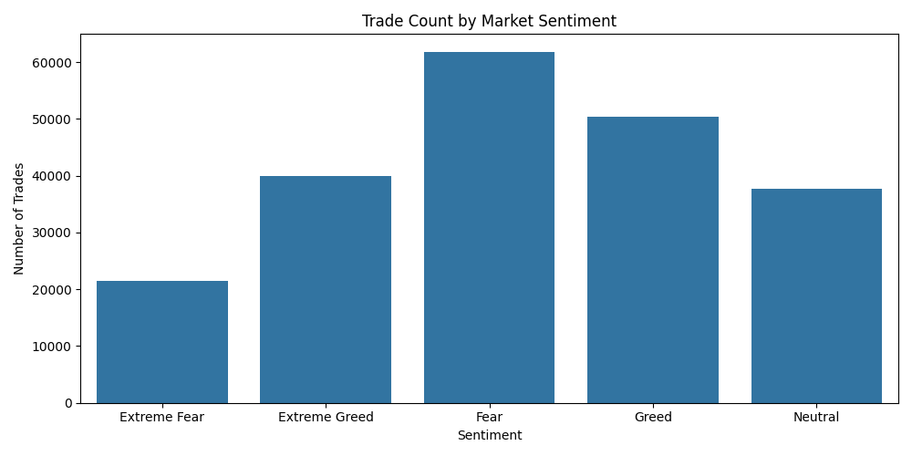
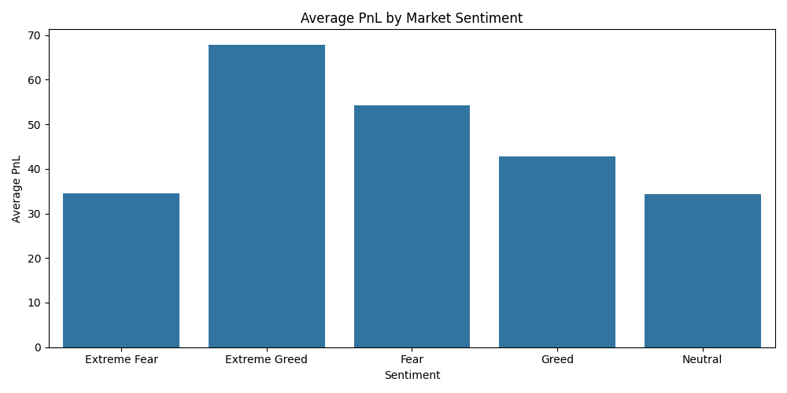
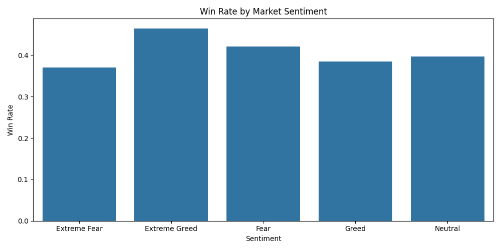
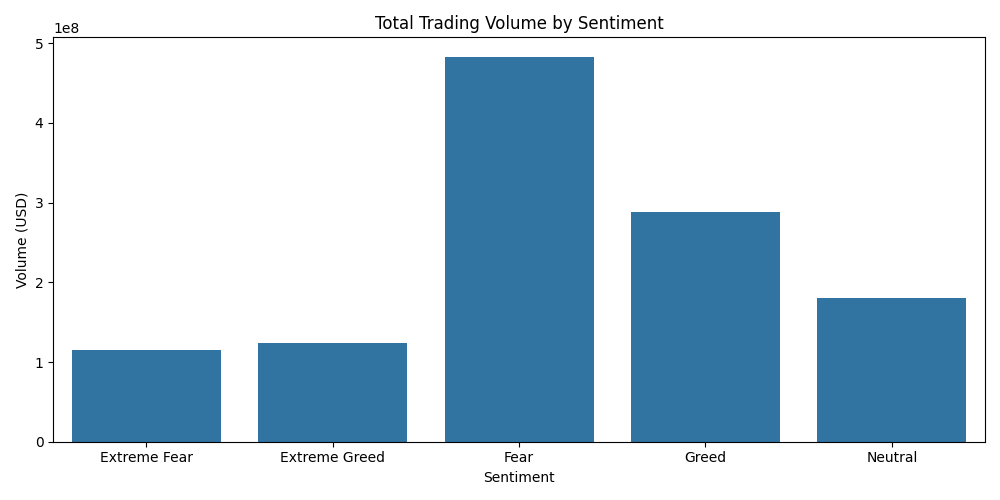
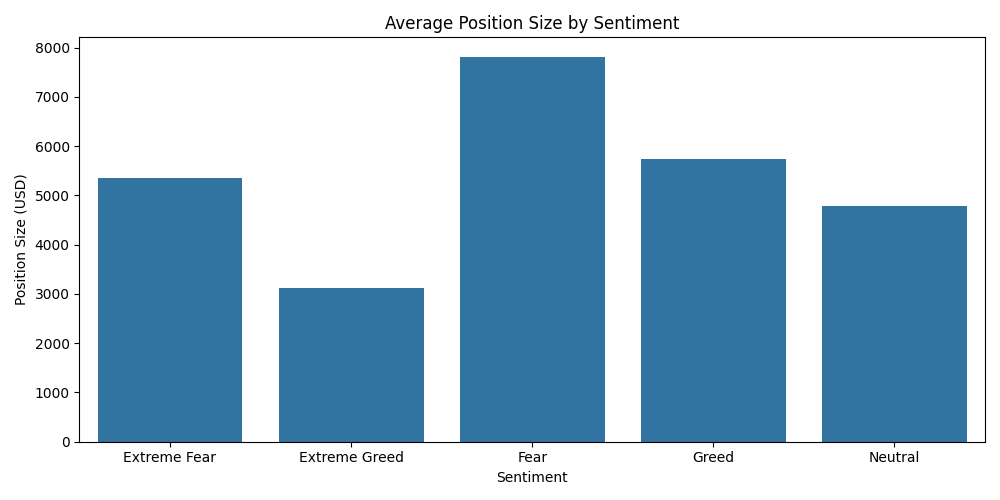
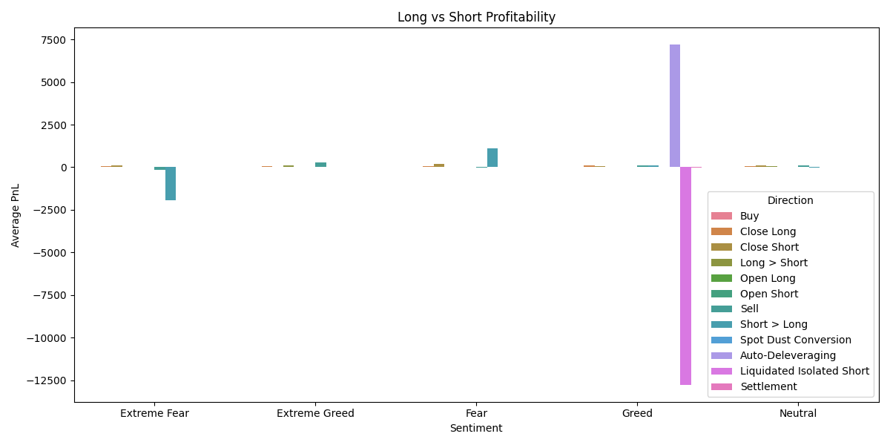
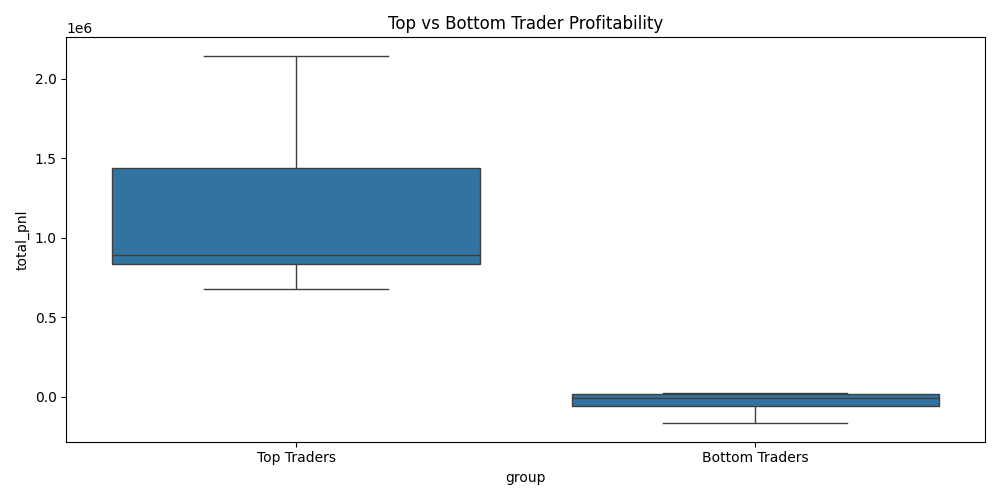
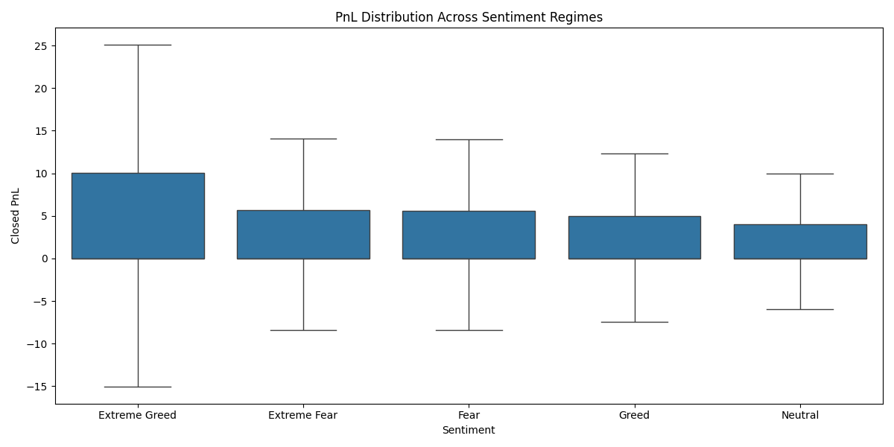

# Prime Trade Sentiment Analysis

## Project Overview

This project investigates the relationship between **Bitcoin market sentiment** and **trader performance** using historical trading activity from Hyperliquid and the Bitcoin Fear & Greed Index.

The objective is to explore how different sentiment regimes influence trader profitability, trading activity, capital allocation behavior, and overall trading efficiency. The analysis aims to uncover hidden patterns and generate actionable insights that can support smarter trading strategies.

---

# Business Objective

The analysis focuses on answering the following questions:

### Q1. How does market sentiment affect trader profitability?

Metrics analyzed:

* Total PnL
* Average PnL
* Median PnL
* Win Rate

### Q2. How does market sentiment affect trading activity?

Metrics analyzed:

* Trade Count
* Total Trading Volume
* Average Position Size

### Q3. Do traders behave differently under different sentiment regimes?

Metrics analyzed:

* Trading Activity
* Position Sizing
* Trade Direction

### Q4. Are top-performing traders different from bottom-performing traders?

Metrics analyzed:

* Profitability
* Volume
* Position Size

### Q5. Does sentiment influence directional trading performance?

Metrics analyzed:

* Long vs Short Performance

### Q6. How does risk efficiency vary across sentiment regimes?

Metrics analyzed:

* PnL per Trade
* PnL per Volume
* Fee per Volume

---

# Dataset Summary

## Hyperliquid Historical Trader Dataset

* 211,224 trades
* 32 unique trader accounts
* Multiple assets and trading directions
* Realized PnL available per trade

## Bitcoin Fear & Greed Dataset

Daily sentiment classification:

* Extreme Fear
* Fear
* Neutral
* Greed
* Extreme Greed

---

# Methodology

### Data Preparation

1. Loaded both datasets.
2. Converted timestamps to datetime format.
3. Created a common trade date key.
4. Cleaned numerical columns.
5. Merged trading activity with daily sentiment data.
6. Generated sentiment-based analytical metrics.

### Merge Quality

| Metric                    |   Value |
| ------------------------- | ------: |
| Total Trades              | 211,224 |
| Missing Sentiment Records |       6 |
| Merge Success Rate        | 99.997% |

---

# Analysis Tables

| Analysis                  | CSV                                                                           |
| ------------------------- | ----------------------------------------------------------------------------- |
| Profitability Analysis    | [profitability_analysis.csv](outputs/tables/profitability_analysis.csv)       |
| Trading Activity Analysis | [trading_activity_analysis.csv](outputs/tables/trading_activity_analysis.csv) |
| Trader Behavior Analysis  | [trader_behavior_analysis.csv](outputs/tables/trader_behavior_analysis.csv)   |
| Long Short Analysis       | [long_short_analysis.csv](outputs/tables/long_short_analysis.csv)             |
| Risk Analysis             | [risk_analysis.csv](outputs/tables/risk_analysis.csv)                         |
| Top Traders               | [top_traders.csv](outputs/tables/top_traders.csv)                             |
| Bottom Traders            | [bottom_traders.csv](outputs/tables/bottom_traders.csv)                       |

---

# Visual Analysis

## 1. Trade Count by Market Sentiment

**Open Image:** [trade_count_by_sentiment.png](outputs/figures/trade_count_by_sentiment.png)



### Observation

Fear periods contained the highest number of trades.

### Insight

Market participants were most active during Fear conditions.

---

## 2. Average PnL by Market Sentiment

**Open Image:** [avg_pnl_by_sentiment.png](outputs/figures/avg_pnl_by_sentiment.png)



### Observation

Extreme Greed produced the highest average profit per trade.

### Insight

Strong bullish sentiment generated the most profitable trading environment.

---

## 3. Win Rate by Market Sentiment

**Open Image:** [win_rate_by_sentiment.png](outputs/figures/win_rate_by_sentiment.png)



### Observation

Extreme Greed achieved the highest win rate.

### Insight

Traders were more likely to close profitable trades during highly optimistic market conditions.

---

## 4. Total Trading Volume by Sentiment

**Open Image:** [total_volume_by_sentiment.png](outputs/figures/total_volume_by_sentiment.png)



### Observation

Fear periods recorded the largest capital deployment.

### Insight

Higher participation and larger capital allocation occurred during Fear periods.

---

## 5. Average Position Size by Sentiment

**Open Image:** [avg_position_size_by_sentiment.png](outputs/figures/avg_position_size_by_sentiment.png)



### Observation

Fear generated the largest average position sizes.

### Insight

Traders appeared willing to take larger positions during fearful markets.

---

## 6. Long vs Short Performance

**Open Image:** [long_short_performance.png](outputs/figures/long_short_performance.png)



### Observation

The Direction field contains multiple transaction types beyond standard Long and Short positions.

### Limitation

Further filtering is required before drawing definitive conclusions regarding directional profitability.

---

## 7. Top vs Bottom Trader Analysis

**Open Image:** [top_vs_bottom_traders.png](outputs/figures/top_vs_bottom_traders.png)



### Observation

Top traders significantly outperformed bottom traders.

### Insight

Trader skill and execution quality appear to have a major impact on profitability.

---

## 8. PnL Distribution by Sentiment

**Open Image:** [pnl_distribution_boxplot.png](outputs/figures/pnl_distribution_boxplot.png)



### Observation

Most trades generated small profits or losses regardless of sentiment.

### Insight

Overall profitability was driven by a relatively small number of highly profitable trades.

---

# Key Findings

## Finding 1: Extreme Greed Produced the Highest Average Profitability

**Related Visualization:**

* [Average PnL by Sentiment](outputs/figures/avg_pnl_by_sentiment.png)

**Supporting Table:**

* [Profitability Analysis](outputs/tables/profitability_analysis.csv)

Extreme Greed generated the highest average profit per trade (67.89), outperforming all other sentiment regimes.

---

## Finding 2: Extreme Greed Achieved the Highest Win Rate

**Related Visualization:**

* [Win Rate by Sentiment](outputs/figures/win_rate_by_sentiment.png)

**Supporting Table:**

* [Profitability Analysis](outputs/tables/profitability_analysis.csv)

Extreme Greed achieved the highest win rate (46.49%), indicating stronger trading outcomes during highly optimistic market conditions.

---

## Finding 3: Fear Generated the Highest Trading Activity

**Related Visualization:**

* [Trade Count by Sentiment](outputs/figures/trade_count_by_sentiment.png)

**Supporting Table:**

* [Trading Activity Analysis](outputs/tables/trading_activity_analysis.csv)

Fear periods generated the highest number of trades (61,837), indicating elevated market participation.

---

## Finding 4: Fear Attracted the Largest Trading Volume

**Related Visualization:**

* [Total Trading Volume](outputs/figures/total_volume_by_sentiment.png)

**Supporting Table:**

* [Trading Activity Analysis](outputs/tables/trading_activity_analysis.csv)

Fear periods recorded the highest trading volume, suggesting greater capital deployment.

---

## Finding 5: Fear Produced the Largest Position Sizes

**Related Visualization:**

* [Average Position Size](outputs/figures/avg_position_size_by_sentiment.png)

**Supporting Table:**

* [Trading Activity Analysis](outputs/tables/trading_activity_analysis.csv)

Fear periods exhibited the largest average position sizes, indicating stronger conviction among traders.

---

## Finding 6: Higher Volume Did Not Necessarily Lead to Higher Profitability

**Related Visualizations:**

* [Total Trading Volume](outputs/figures/total_volume_by_sentiment.png)
* [Average PnL](outputs/figures/avg_pnl_by_sentiment.png)

Fear generated the highest volume while Extreme Greed generated the highest profitability, highlighting the importance of trading efficiency.

---

## Finding 7: Top Traders Vastly Outperformed Bottom Traders

**Related Visualization:**

* [Top vs Bottom Traders](outputs/figures/top_vs_bottom_traders.png)

**Supporting Tables:**

* [Top Traders](outputs/tables/top_traders.csv)
* [Bottom Traders](outputs/tables/bottom_traders.csv)

Top traders consistently generated substantial profits while bottom traders remained significantly negative.

---

## Finding 8: Most Trades Generated Minimal Realized Profit

**Related Visualization:**

* [PnL Distribution](outputs/figures/pnl_distribution_boxplot.png)

**Supporting Table:**

* [Profitability Analysis](outputs/tables/profitability_analysis.csv)

Median PnL remained close to zero across all sentiment regimes.

---

## Finding 9: A Small Number of Trades Drove Overall Profitability

**Related Visualization:**

* [PnL Distribution](outputs/figures/pnl_distribution_boxplot.png)

Overall profitability was heavily influenced by a relatively small number of highly profitable trades.

---

# Trading Strategy Recommendations

### Recommendation 1

Monitor market sentiment before increasing exposure. Extreme Greed historically generated the strongest profitability and win rates.

### Recommendation 2

Avoid evaluating performance solely through trading volume. Higher activity did not automatically translate into higher profitability.

### Recommendation 3

Focus on identifying high-conviction opportunities. A small number of trades generated the majority of profits.

### Recommendation 4

Emphasize execution quality and discipline. Top traders substantially outperformed bottom traders under similar market conditions.

---

# Technology Stack

* Python
* Pandas
* NumPy
* Matplotlib
* Seaborn
* SciPy

---

# How to Run

```bash
pip install -r requirements.txt
python main.py
```

Generated outputs:

```text
outputs/
├── figures/
└── tables/
```

---

# Repository Structure

```text
prime-trade-sentiment-analysis/
│
├── data/
├── outputs/
│   ├── figures/
│   └── tables/
│
├── src/
│   ├── data_loader.py
│   ├── preprocessing.py
│   ├── sentiment_analysis.py
│   ├── trader_analysis.py
│   └── visualization.py
│
├── main.py
├── requirements.txt
├── .gitignore
└── README.md
```

---

# Conclusion

This analysis demonstrates that market sentiment has a measurable relationship with trader performance, trading activity, and capital allocation behavior.

Extreme Greed produced the highest profitability and win rates, while Fear generated the highest trading activity, trading volume, and position sizes. Additionally, profitability was concentrated in a relatively small number of winning trades, emphasizing the importance of trade selection, execution quality, and risk management over pure trading frequency.
